## Hello, I'm Tatiana! 👋

### [🎥 Link to my Video CV](https://youtu.be/uJQMlCJasOU)

## My Contacts

* __Location:__ Ukraine 🇺🇦
* __E-mail:__   [belangelphone@gmail.com](mailto:belangelphone@gmail.com)
* __Phone:__    [+380505551402](tel:+380505551402)
* __Discord:__  [Tetiana-KET](https://discordapp.com/users/674720964143218723)
* __Telegram:__ [Send me a message in telegram](https://t.me/Tatiana_1000_Dribnyz)
* __GitHub:__   [Tetiana-KET](https://github.com/Tetiana-KET)

## About Me

- 🎓 I graduated with a degree in __foreign languages__ from Fedkovech Chernovtsy University.
- ✈️ My journey into coding began accidentally, for fun. But, I found myself drawn to the magic of JavaScript.
- 💻 Currently, I am taking the __RS School Front-end course__ and I'm excited to continue my journey into the world of IT.
- 🌟 __I believe that each challenge is an opportunity for growth and learning, and I'm committed to embracing them along my journey.__

## Skills and tools

## My Projects

  [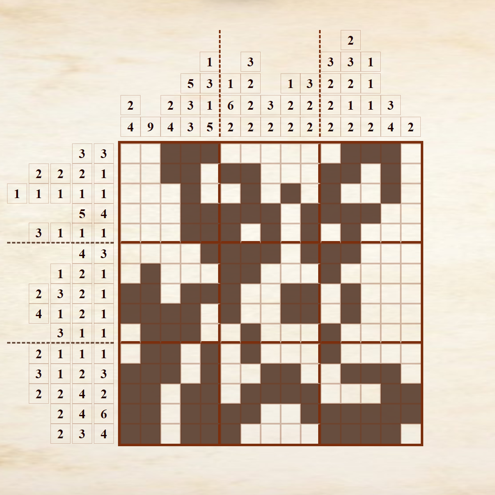](https://rolling-scopes-school.github.io/tetiana-ket-JSFE2023Q4/nonograms/index.html)

  [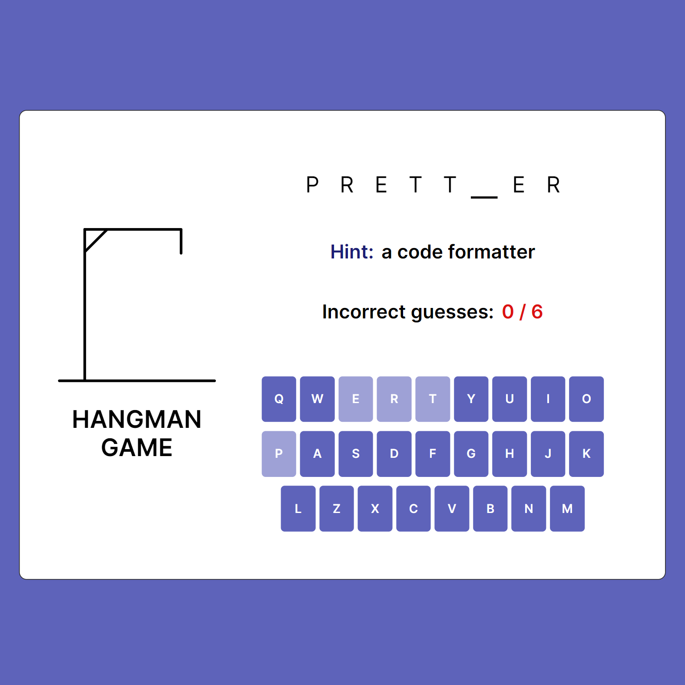](https://rolling-scopes-school.github.io/tetiana-ket-JSFE2023Q4/hangman/index.html)

  [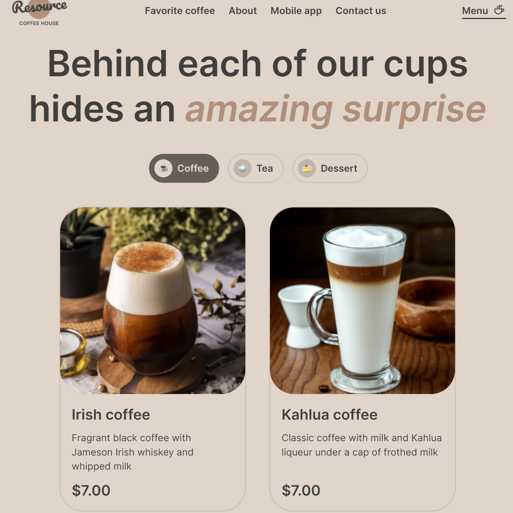](https://rolling-scopes-school.github.io/tetiana-ket-JSFE2023Q4/coffee-house/pages/Home/index.html)

  [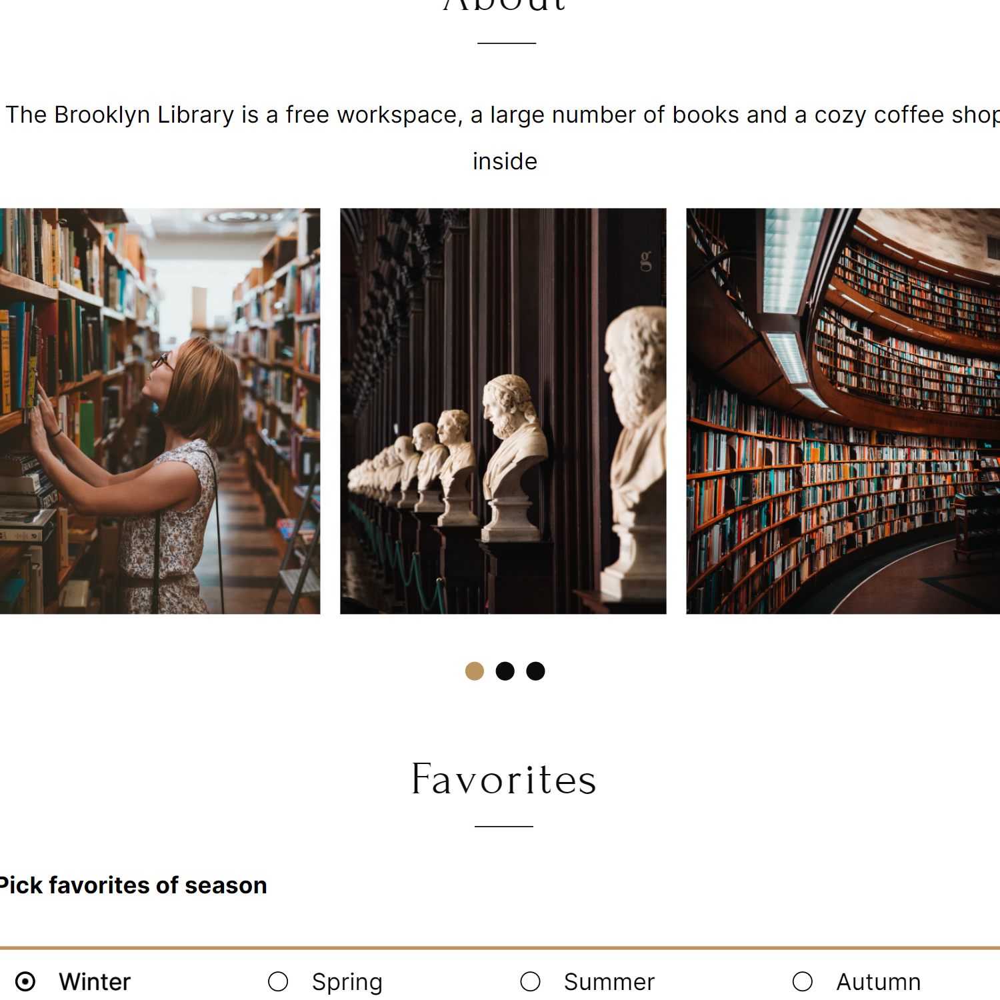](https://tetiana-ket.github.io/Library/)

  [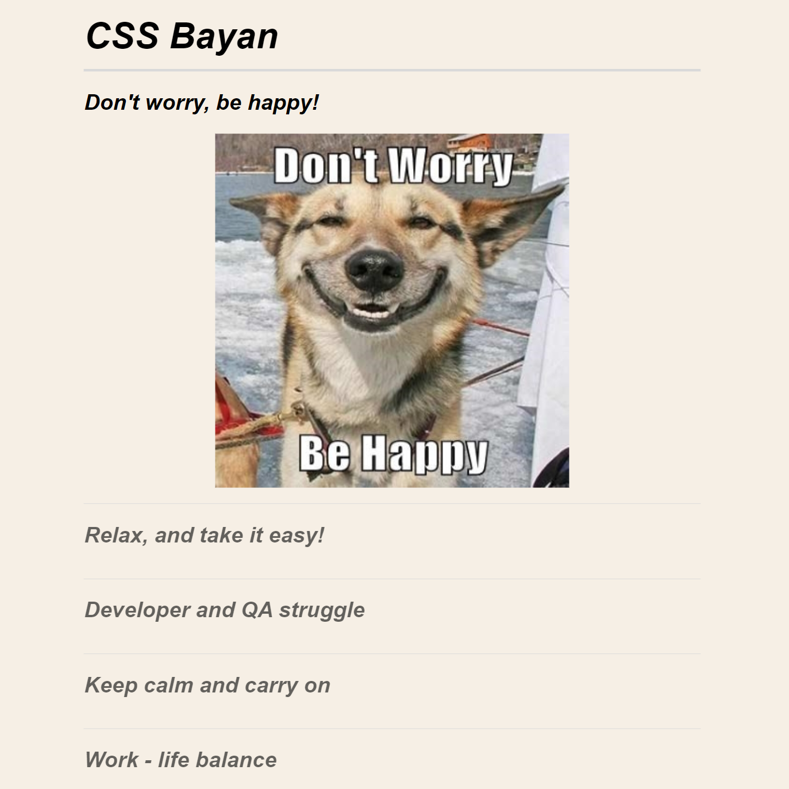](https://tetiana-ket.github.io/cssBayan/cssBayan/index.html)

  [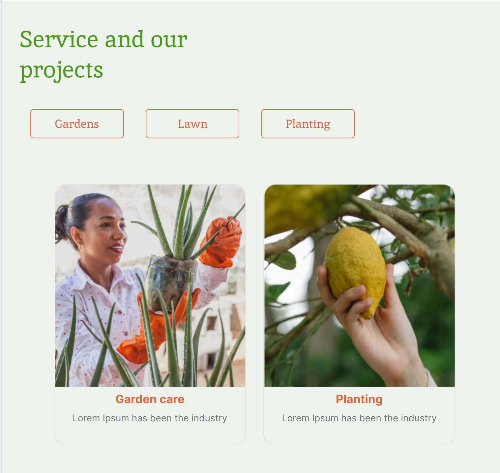](https://rolling-scopes-school.github.io/tetiana-ket-JSFEPRESCHOOL2022Q4/Plants/pages/main/index.html)

  [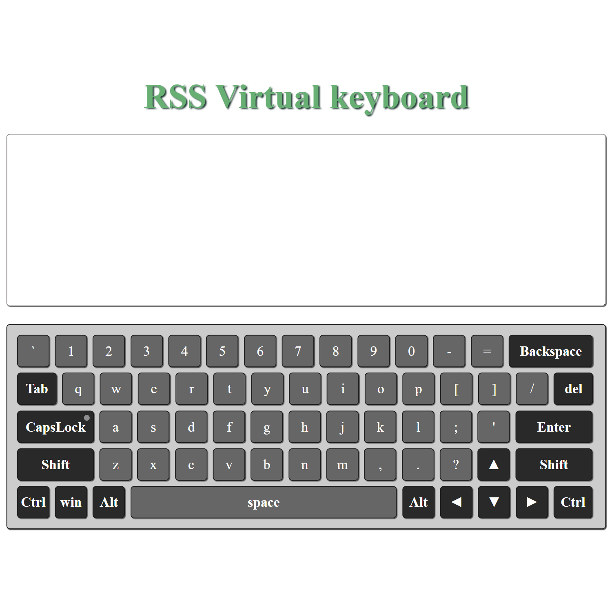](https://tetiana-ket.github.io/virtual-keyboard/src/index.html)

  [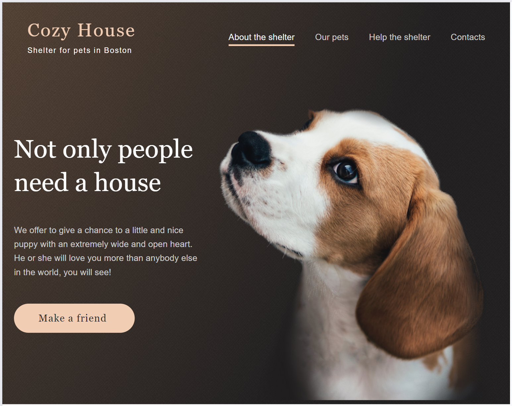](https://rolling-scopes-school.github.io/tetiana-ket-JSFE2023Q1/shelter/pages/main/index.html)

  [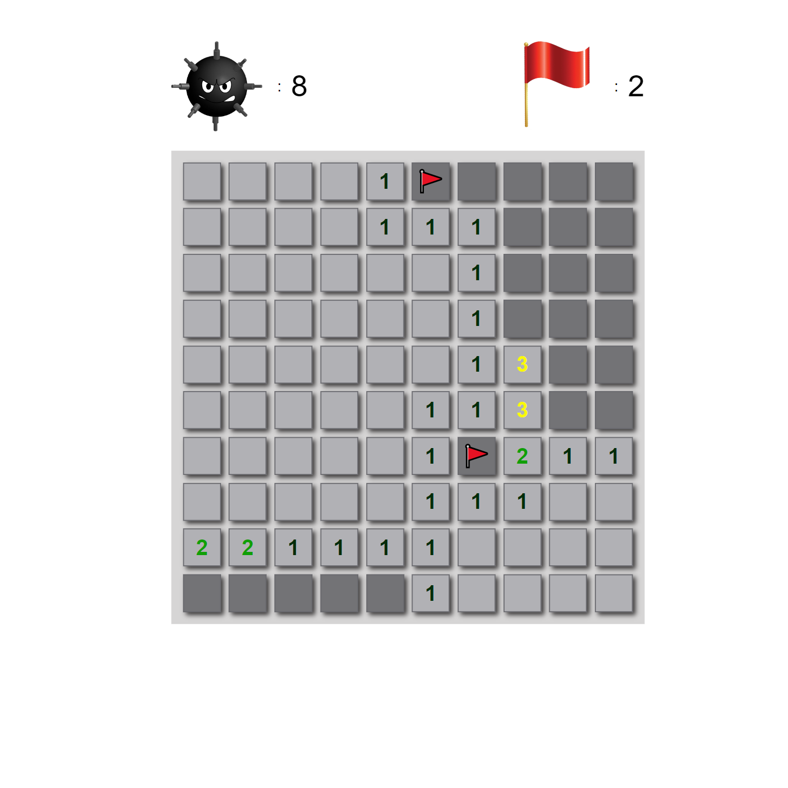](https://rolling-scopes-school.github.io/tetiana-ket-JSFE2023Q1/minesweeper/dist/index.html)

  [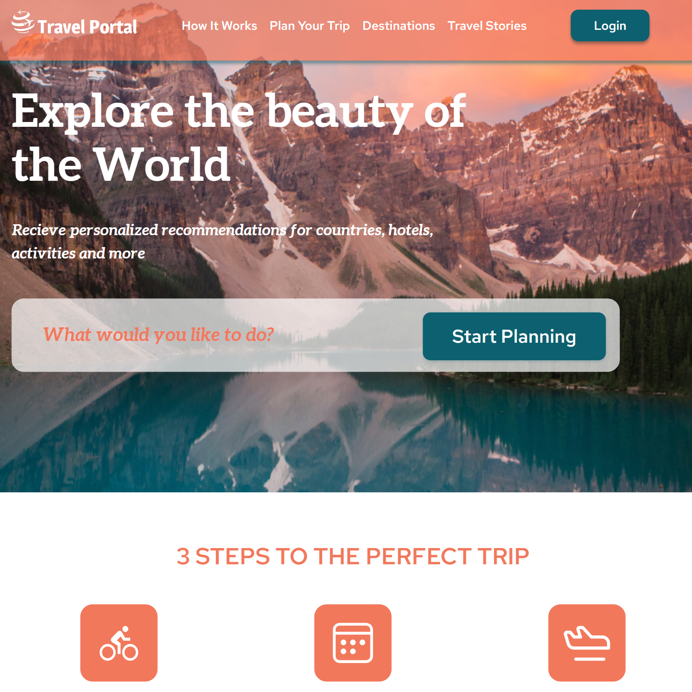](https://tetiana-ket.github.io/Travel/)

  [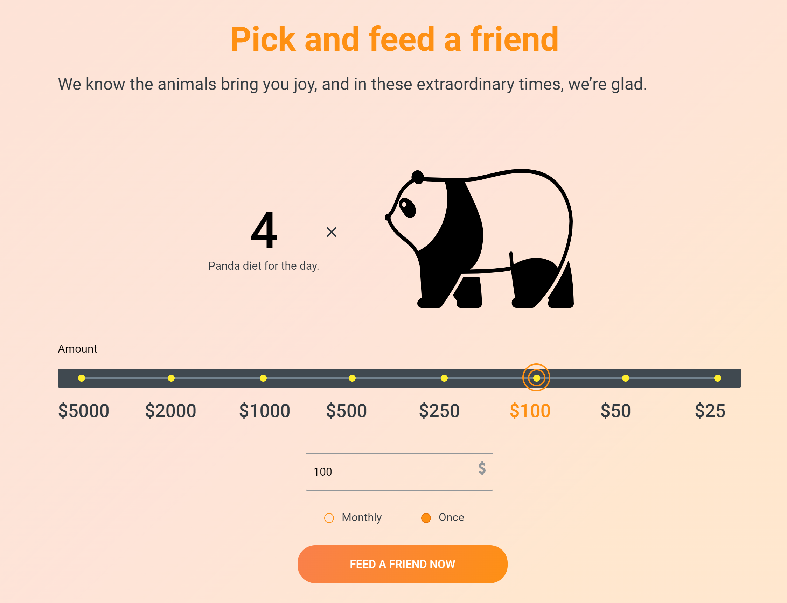](https://tetiana-ket.github.io/online-zoo/pages/main/index.html)

